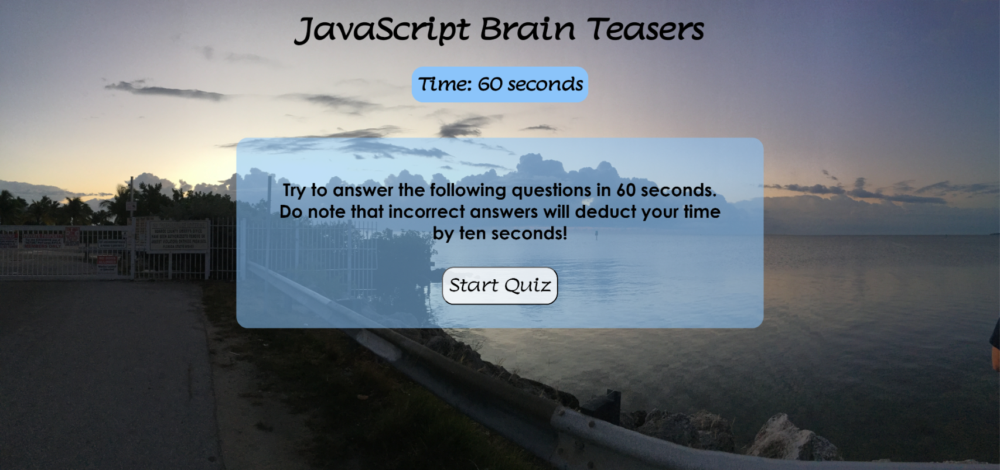

# JavaScript Brain Teasers
A coding assessment that includes a timed coding quiz with multiple choice questions. 


## Webpage Preview
[Click here to Take the Quiz](https://kwaters3.github.io/Code-Quiz/)




## User Story

```
AS A coding boot camp student
I WANT to take a timed quiz on JavaScript fundamentals that stores high scores
SO THAT I can gauge my progress compared to my peers
```

## Acceptance Criteria

```
GIVEN I am taking a code quiz
WHEN I click the start button
THEN a timer starts and I am presented with a question
WHEN I answer a question
THEN I am presented with another question
WHEN I answer a question incorrectly
THEN time is subtracted from the clock
WHEN all questions are answered or the timer reaches 0
THEN the game is over
WHEN the game is over
THEN I can save my initials and my score
```

## How to Use

Test your knowledge on basic Javascript coding questions in 60 seconds. 
The timer begins once you click the start button, for every wrong answer choice, the timer will deduct 10 seconds from the clock. 
Correct answers will be displayed if a wrong answer is selected. 
Final score will be displayed once the quiz is done or the time runs out. 
You can save your score at the end of the game. 
Good Luck!


## Credits

-[GreatStack](https://www.youtube.com/watch?v=PBcqGxrr9g8) Information Video on JavaScript and functions

-[BroCode](https://www.youtube.com/watch?v=8dWL3wF_OMw&t=2499s) Information Video on JavaScript

-[W3Schools](https://www.w3schools.com/js/default.asp) Information on JavaScript 
